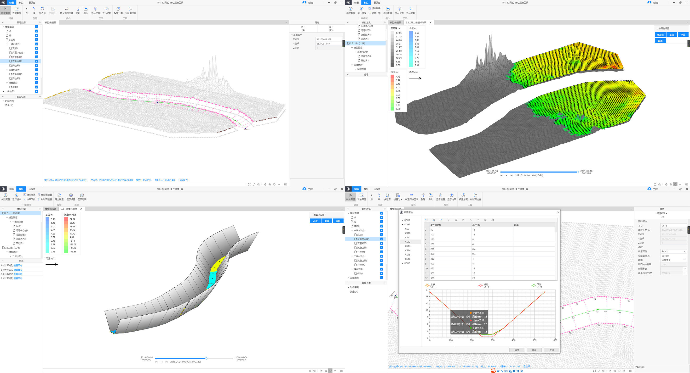

# 个人简历

Web 前端开发 - 刘念 - 本科 - 5 年

---

# 联系方式

- 手机：[13199410022](tel:13199410022)
- Email：[liunian@2077tech.com](mailto:liunian@2077tech.com) / [lnasdjgfr8@gmail.com](mailto:lnasdjgfr8@gmail.com)
- QQ：[1041001122](tencent://message/?uin=1041001122&Site=2077tech.com&Menu=yes)

---

# 基本信息

- 刘念/男/1994
- 本科/哈尔滨石油学院
- 工作年限：**5**年
- 技术博客：[https://liunian.js.org/](https://liunian.js.org/) _(`GitHub Pages`，打不开注意`DNS`污染)_
- 个人网站：[https://www.2077tech.com/](https://www.2077tech.com/)
- GitHub：[https://github.com/asdjgfr/](https://github.com/asdjgfr/)
- 期望职位：Web 前端工程师
- 期望薪资：20k - 25k
- 期望城市：北京 不接受出差

---

# 工作经历

## [浙江贵仁信息科技股份有限公司](http://www.keepsoft.net/) （ 2019 年 3 月 ~ 至今 ）

### 贵仁建模工具

对标`MIKE`、`SMS`的表面水建模系统，基于`Electron`，使用`Vue.js 2.x`进行开发。使用`WebAssembly`,`worker`等技术扩展`js`的单线程，使用`node-ffi`+`Golang`解决了千万级数据导入`Moment.js`/`Day.js`格式化缓慢的问题。架构中使用`rpc`解决了传统`http`性能开销大与`ipc`上云兼容性的问题。同时实现千万级数据的处理，操作，表格展示等。

## [北京国信达数据技术有限公司](http://cindata.cn/) （ 2018 年 2 月 ~ 2019 年 3 月 ）

### 青岛/七台河/大连/哈尔滨 地税管理系统

负责整体前端部分，前期使用`Bootstrap3`实现自适应，框架使用`jQuery`等进行开发，后期部分功能繁琐引入`Vue`进行后半部分项目开发。使用服务端渲染，在消息模块部分使用了`websocket`替换了原本的`ajax`轮询。地图使用`ArcGIS`进行开发。

### 哈尔滨土地大数据可视化

负责整体前端部分，项目采用前后端分离进行开发。前端框架使用`React`，UI 框架使用`AntDesign`，图表使用`ECharts 4.x`，在大屏地图展示的部分使用了 `ECharts GL`。

### 哈尔滨土地财政系统

同哈尔滨土地大数据可视化技术栈，同样采用`React`+`AntDesign`来实现。地图使用`ArcGIS`进行开发。

### GIS AMS 资产管理系统

前端框架使用`React`，UI 框架使用`AntDesign`。整个系统较为复杂，所以数据流方案使用了`Dva.js`。为更快的了解决权限方面的问题整体使用基于`Umi.js`的解决方案。地图使用`ArcGIS`进行开发。

### valPro 微信端

布局使用了`Flex`的方式，在移动端使用了`vw`+`rem`共存的解决办法。框架使用`React`，UI 框架使用`AntDesign Mobile`进行开发的微信端网页，集成了微信登录等功能。

---

## [东软集团](https://www.neusoft.com/cn/)（ 2016 年 10 月 ~ 2018 年 2 月 ）

### 哈医大窗口缴费系统

负责哈医大窗口缴费系统的开发与维护，使用原生`HTML`,`CSS`,`js` 进行开发，确保兼容`IE6.0`以上浏览器。项目期间主要负责部分模块的开发与维护以及与后台的对接，同时保证在`IE`低版本上正确运行。

---

# 开源项目和作品

## [operationRecord](https://github.com/asdjgfr/operationRecord)

利用现代浏览器提供的`API`还原操作并储存方便`debug`。负责整个项目的前后端开发。框架使用`Vue 3.x`，UI 框架使用 `Element Plus` 以便更快的构建清晰的页面。后端技术使用 `Node.js`，应用框架使用了 `NestJS`，在数据库方向使用了`TypeORM `兼容多种数据库。

## 微信公众号

刘念的个人博客

---

# 技能清单

- 编程语言：`JavaScript`,`TypeScript`,`Golang`,`Python`
- 前端框架：`Vue.js`,`React`,`jQuery`
- Web 框架：`NestJS`,`Koa.js`,`Express`,`Gin`
- UI 工具：`PhotoShop`,`Illustrator`,`AfterEffect`...
- 其他：`Node.js`,`Electron`,`Taro`,`uni-app`

---

# 致谢

感谢您花时间阅读我的简历，期待能有机会和您共事。
